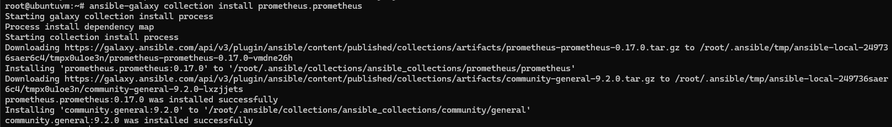

# Описание ДЗ:

1. На виртуальной машине установите любую open source CMS, которая включает в себя следующие компоненты: nginx, php-fpm, database (MySQL or Postgresql)
2. На этой же виртуальной машине установите Prometheus exporters для сбора метрик со всех компонентов системы (начиная с VM и заканчивая DB, не забудьте про blackbox exporter, который будет проверять доступность вашей CMS)
3. На этой же или дополнительной виртуальной машине установите Prometheus, задачей которого будет раз в 5 секунд собирать метрики с экспортеров.

## Задание со звездочкой (повышенная сложность)
* на VM с установленной CMS слишком много “портов экспортеров торчит наружу” и они доступны всем, попробуйте настроить доступ только по одному и добавить авторизацию.

* Если вы выполнили задание со звездочкой номер 1, то - добавить SSL =)

В качестве результата ДЗ принимаются - файл конфигурации Prometheus.

---

# Решение

## Машина с CMS

Установил на машину **LEMP** и WordPress

- Nginx


- php-fpm


- MySql


- WordPress


Ссылки по теме:

- [https://www.howtoforge.com/how-to-install-joomla-on-rocky-linux/](https://www.howtoforge.com/how-to-install-joomla-on-rocky-linux/)
- [https://www.dmosk.ru/miniinstruktions.php?mini=wordpress-nginx-rpm](https://www.dmosk.ru/miniinstruktions.php?mini=wordpress-nginx-rpm)
- [https://www.tecmint.com/enable-monitor-php-fpm-status-in-nginx/](https://www.tecmint.com/enable-monitor-php-fpm-status-in-nginx/)

## Установка Prometheus exporters

Установил ansible коллекции prometheus для установки и настройки Prometheus exporters

 - nginx_exporter
 - mysqld_exporter
 - node_exporter
 - blackbox_exporter

```bash
ansible-galaxy collection install prometheus.prometheus
```



Написал простую ansible [role](ansible/roles/php_fpm_exporter) для установки **php_fpm_exporter**

Написал ansible-playbook [site.yml](ansible/site.yml) для установки exporters

Выполнил установку exporters

```bash
ansible-playbook site.yml -i inventory/prometheus.yml -u root -k
```


---

Exporters запущены и отображают метрики

 - nginx_exporter


 - mysqld_exporter


 - node_exporter


 - php_fpm_exporter


 - blackbox_exporter


---

## Установка Prometheus

Для запуска Prometheus использовал Docker [docker-compose.yml](prometheus/docker-compose.yml)

Конфигурация Prometheus писана в файле [prometheus.yml](prometheus/prometheus.yml)

Все таргеты и их метрики доступны в Prometheus с интервалом сбора в 5 секунд


