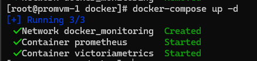
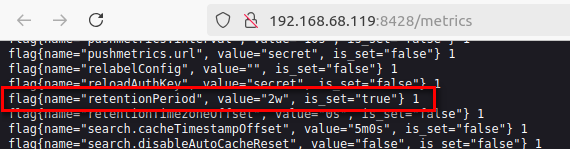
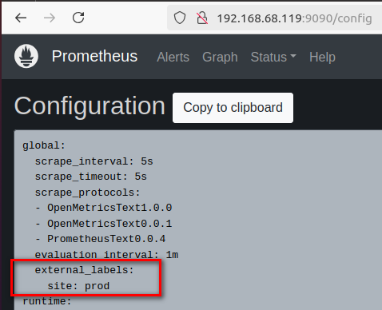
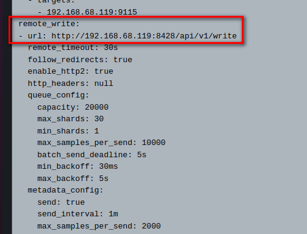
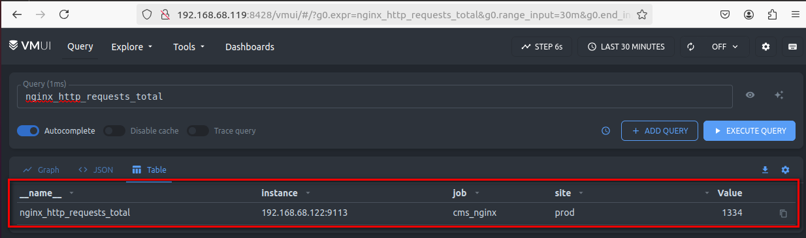

# Домашнее задание
## Хранилище метрик

### Цель:
Научиться устанавливать и работать с хранилищем метрик.
В данном дз вы можете воспользоваться наработками из предыдущего.

### Описание/Пошаговая инструкция выполнения домашнего задания:
Для Prometheus необходимо установить отдельно хранилище метрик (Victoria Metrics, Grafana Mimir, Thanos, etc.).

Во время записи метрики в хранилище Prometheus должен дополнительно добавлять лейбл site: prod.

### Дополнительные параметры хранилища:

Metrics retention - 2 weeks
В качестве результата ДЗ принимаются - файл конфигурации системы хранения, файл конфигурации Prometheus.

# Решение

Для метрик была переиспользована машина из прошлого ДЗ [03-Prometheus-exporters](03-Prometheus-exporters/README.md)
`#Машина с CMS`, в качестве долговременного хранилища метрик выбрал Victoria Metrics.

Prometheus и Victoria Metrics запущены в Docker [docker-compose.yml](docker/docker-compose.yml), там же
для Victoria Metrics описаны *Metrics retention - 2 weeks*, `-retentionPeriod=2w`

Скрин метрики самой Victoria Metrics про флаг `-retentionPeriod=2w`

Настройка пересылки метрик из Prometheus в Victoria Metrics и добавление лейбла `site: prod` 
описана в [prometheus.yml](prometheus/prometheus.yml)

Метрики успешно пишутся и читаются в Victoria Metrics, так же доступен лейбл `site: prod` 

