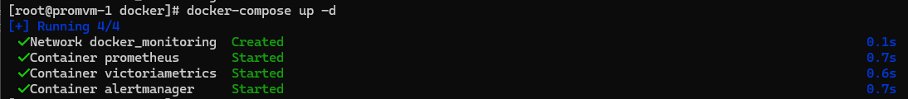
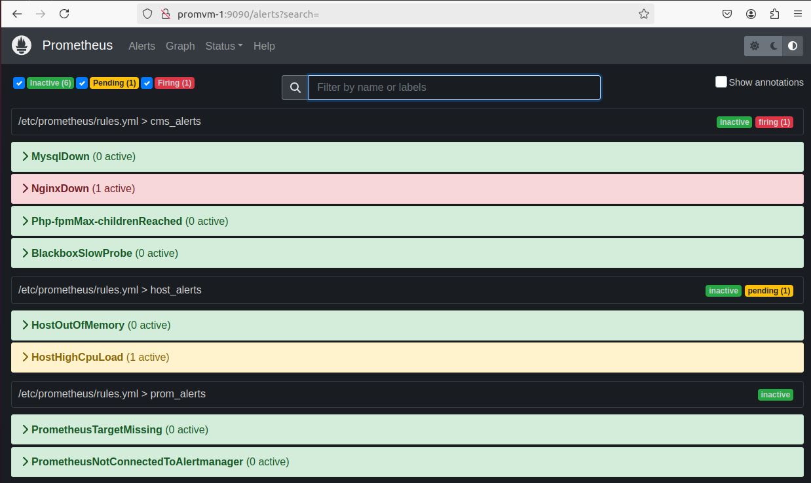
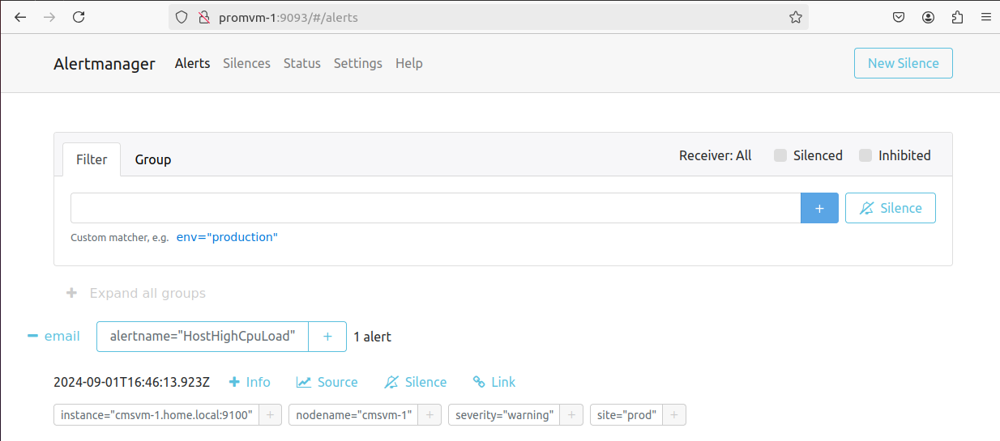
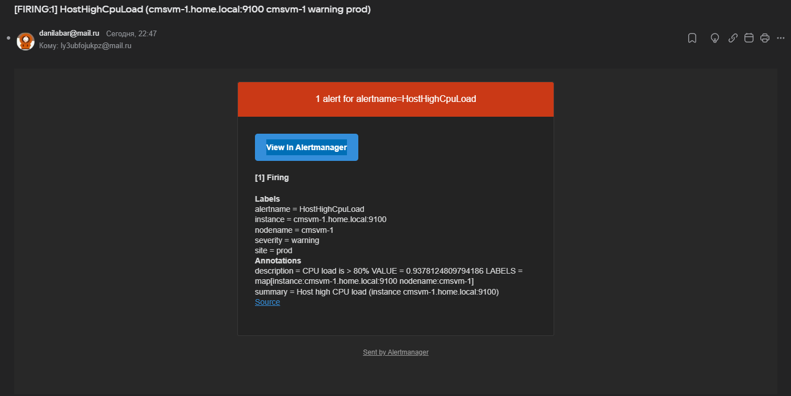
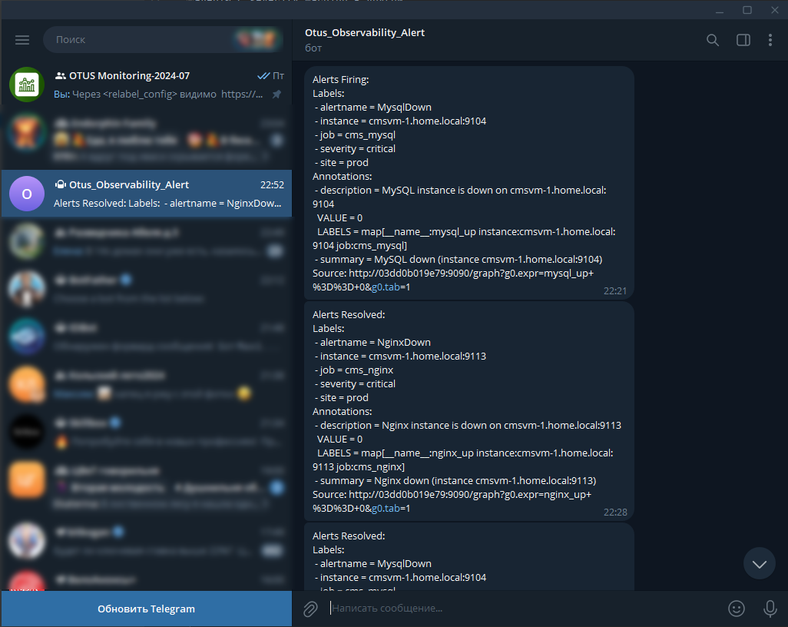

# Домашнее задание
## Настройка алертинга

### Цель:
Научиться настраивать алертинг.
В данном дз вы можете воспользоваться наработками из предыдущего.

###  Описание/Пошаговая инструкция выполнения домашнего задания:
- Дополнительно установите Alertmanager, настройки алертинг в один из каналов оповещений на ваш выбор 
(Telegram, email, Slack, etc.);
- Создайте набор alert`ов с различными Severity. Для начала ограничтесь warning и critical;
- Alertmanager должен уметь отправлять алерты с severity critical в один канал оповещений, в то время как 
алерты с severity warning в другой;
- В качестве результата ДЗ принимаются - файл конфигурации Alertmanager

---

# Решение

Для метрик была переиспользована машина из прошлого ДЗ [03-Prometheus-exporters](../03-Prometheus-exporters/README.md)
`#Машина с CMS`.

В [docker-compose.yml](docker/docker-compose.yml) добавил Alertmanager

- Настройки для отправки алертинга Prometheus описаны в [prometheus.yml](prometheus/prometheus.yml)
- Создал набор alert`ов с различными Severity [rules.yml](prometheus/rules.yml), 
правила подсмотрел в [Awesome Prometheus alerts](https://samber.github.io/awesome-prometheus-alerts/rules.html)
- Конфигурация Alertmanager описана в [alertmanager.yml](alertmanager/alertmanager.yml)
  - Отправка уведомлений осуществляется по правилам:
    - severity `warning` - email
    - severity `critical` - telegram

Набор алертов доступен в Prometheus

Алетры приходят в Alertmanager

Алерты с severity `warning` согласно правилам маршрутизации отправляются на `email`

Алерты с severity `critical` согласно правилам маршрутизации отправляются в `telegram`

