# Домашнее задание

Формирование dashboard на основе собранных данных с Grafana

## Цель

Сформировать dashboard на основе собранных данных с Grafana

## Описание/Пошаговая инструкция выполнения домашнего задания:

Для выполнения данного ДЗ воспользуйтесь наработками из предыдущего домашнего задания.

На VM с установленным Prometheus установите Grafana последней версии доступной на момент выполнения ДЗ:

- Создайте внутри Grafana папки с названиями infra и app;
- Внутри директории infra создайте дашборд, который будет отображать сводную информацию по инфраструктуре 
(CPU, RAM, Network, etc.);
- Внутри директории app создайте дашборд, который будет отображать сводную информацию о CMS (доступность компонентов, 
время ответа, etc.);

## Задание со звездочкой

- При помощи Grafana создайте alert о недоступности одного из компонентов CMS и инфраструктуры;
- Создайте DrillDown dashboard который будет отображать сводную информацию по инфраструктуре, но нажав на 
конкретный инстанс можно получить полную информацию.

## Результат

Переиспользуйте репозиторий созданный для сдачи предыдущего ДЗ.

Дополните Readme описание действий выполненных в результате выполнения данного ДЗ.

В директорию GAP-2 приложите скриншоты дашбордов которые вы создали.

---

# Решение

Для метрик была переиспользована машина из прошлого ДЗ [03-Prometheus-exporters](../03-Prometheus-exporters/README.md)
`#Машина с CMS`.

## Запуск и настройка Grafana, Prometheus

С помощью [docker-compose](docker/docker-compose.yml) развернул `prometheus`, `grafana` и `grafana-renderer`.

Все задачи в Grafana выполнены с помощью provisioning конфигураций

- [datasources](grafana/provisioning/datasources)
- [dashboards](grafana/provisioning/dashboards)
- [alerting](grafana/provisioning/alerting)

## Grafana Dashboards

За основу для дашбордов компонентов CMS взял готовые из [GrafanaLabs](https://grafana.com/grafana/dashboards/), 
привёл их в рабочее состояние под свои экспортеры, что-то поменял и добавил параметров для большей шаблонизации.

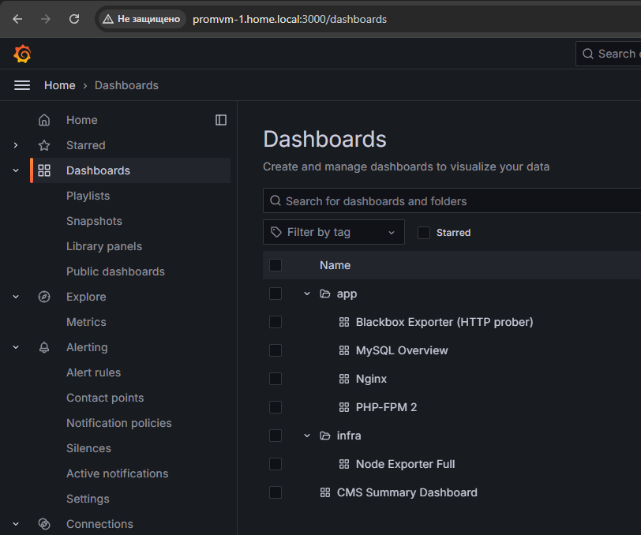

- Blackbox

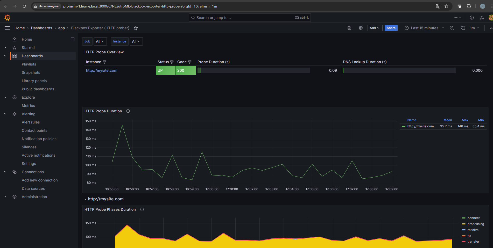

- MySQL

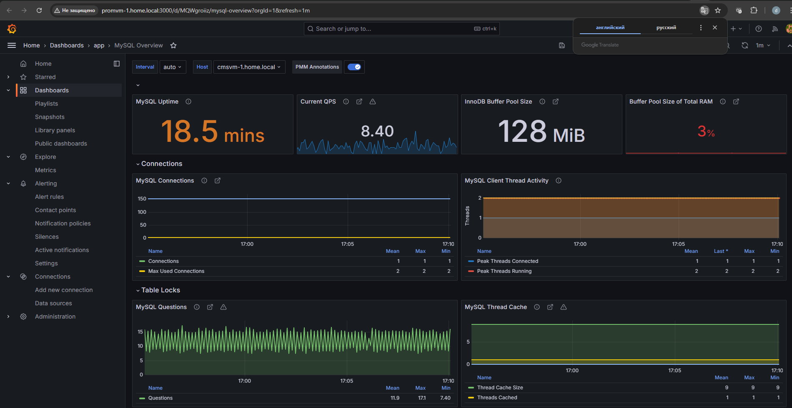

- Nginx

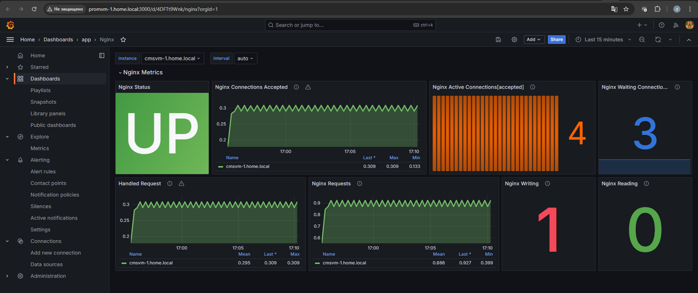

- PHP-FPM

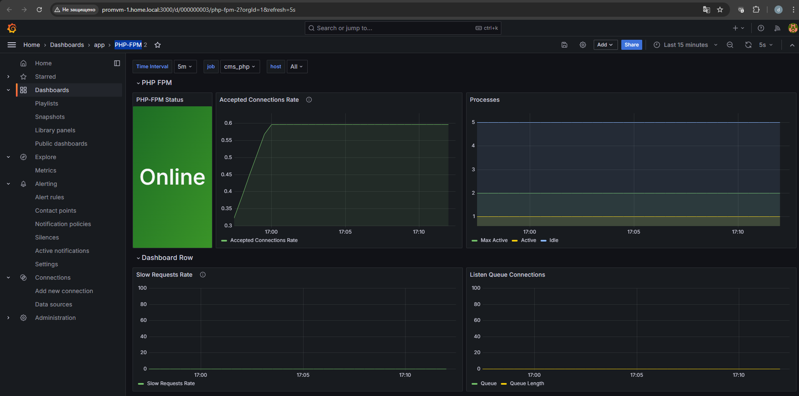

- Node

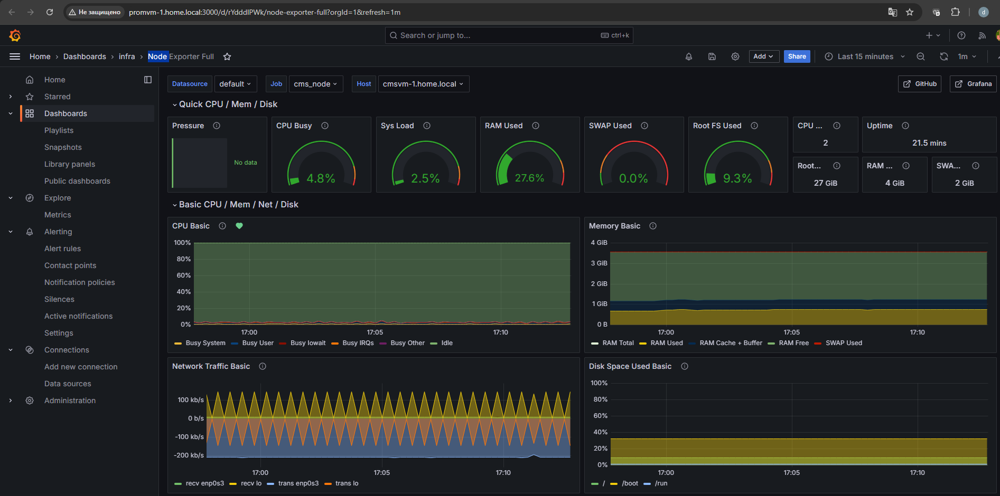

Создал сводный DrillDown dashboard

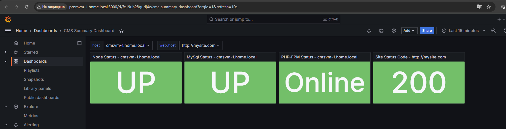

При нажатии на "кубик" происходит перенаправление в дашборд соответствующего компонента системы, 
с фильтром по выбранному хосту

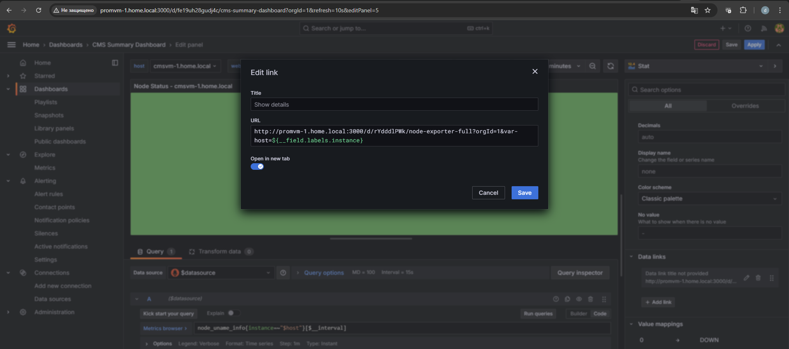

## Grafana Alerting

Настроил отправку оповещений в Telegram и добавил его в качестве основного канала в политике уведомлений

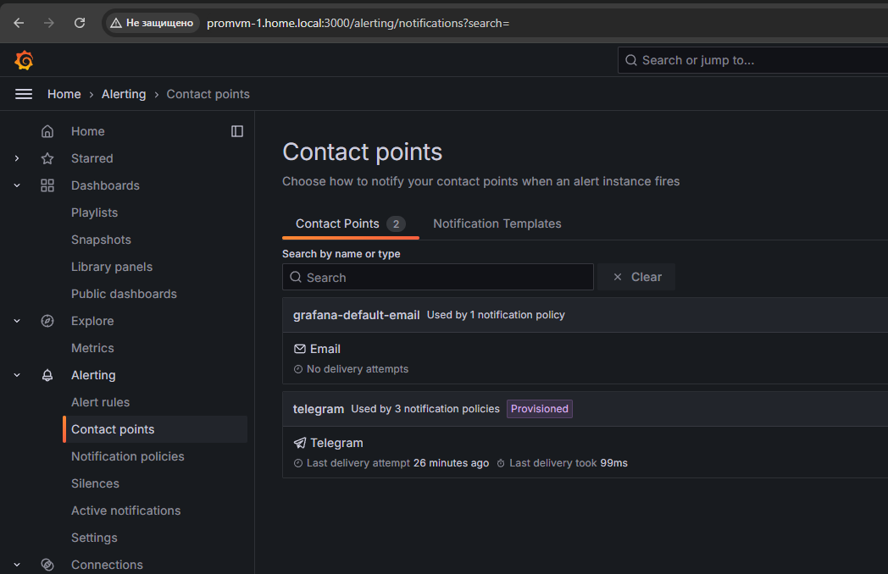

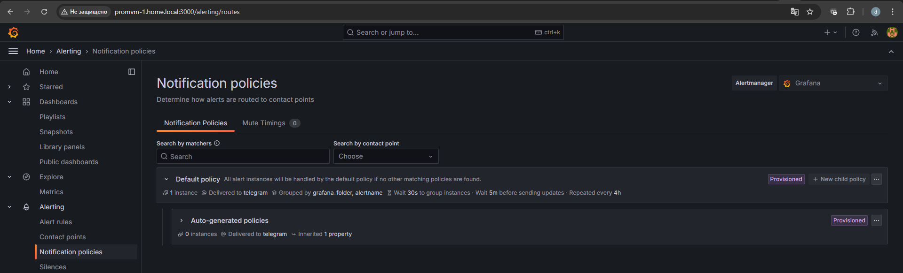

Создал 2 правила оповещений, о 500-х ошибках и повышенной утилизации CPU

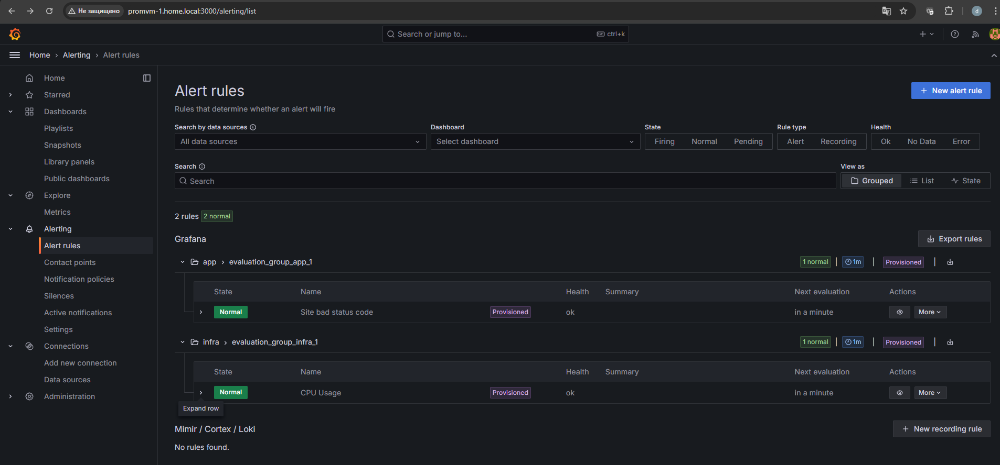

Во время имитации сбоя, соответствующие алерты были отправлены

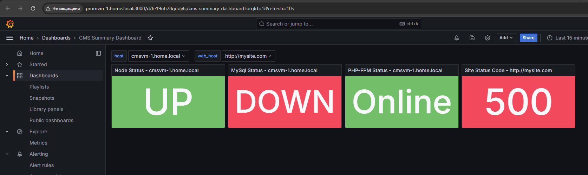

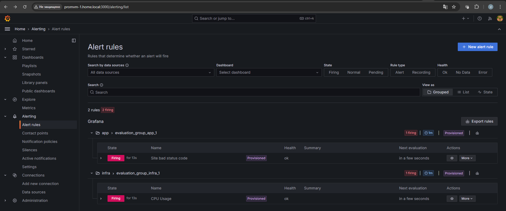

- CPU

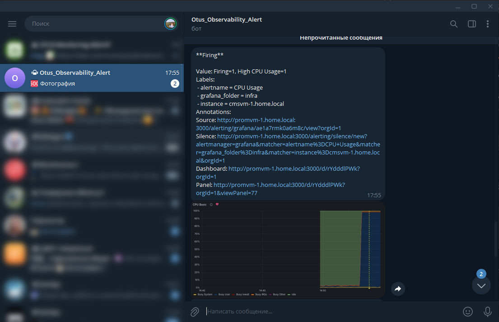

- Status code 500

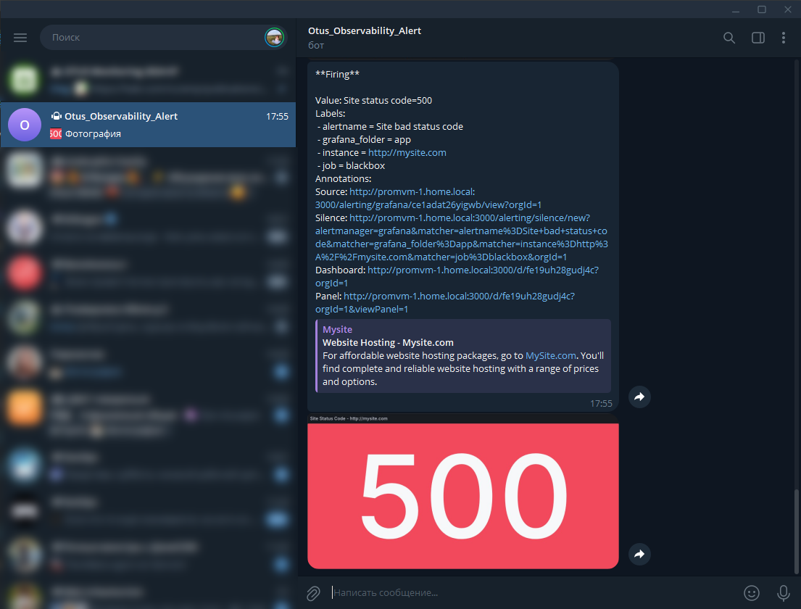

