# Домашнее задание
Настройка zabbix, создание LLD, оповещение на основе триггеров

## Цель:
Установить и настроить zabbix, настроить автоматическую отправку аллертов в телеграмм канал.

## Описание/Пошаговая инструкция выполнения домашнего задания:
Необходимо сформировать скрипт генерирующий метрики формата:

```text
otus_important_metrics[metric1]
otus_important_metrics[metric2]
otus_important_metrics[metric3]
```
С рандомным значение от 0 до 100

Создать правила LLD для обнаружения этих метрик и автоматического добавления триггеров. 
Триггер должен срабатывать тогда, когда значение больше или равно 95.

Реализовать автоматическую отправку уведомлений в телеграмм канал.

В качестве результаты выполнения ДЗ необходимо предоставить скрипт генерации метрик, 
скриншоты графиков полученных метрик, ссылку на телеграмм канал с уже отпраленными уведомлениями.

---

# Решение

## Установка Zabbix

Установил Zabbix на виртуальную машину согласно [официальной документации](https://www.zabbix.com/ru/download?zabbix=7.0&os_distribution=rocky_linux&os_version=9&components=server_frontend_agent&db=mysql&ws=nginx)

### Zabbix сервер, веб-интерфейс и агент

```shell
rpm -Uvh https://repo.zabbix.com/zabbix/7.0/rocky/9/x86_64/zabbix-release-7.0-5.el9.noarch.rpm
dnf clean all

dnf install zabbix-server-mysql zabbix-web-mysql zabbix-nginx-conf zabbix-sql-scripts zabbix-selinux-policy zabbix-agent
dnf install mysql-server -y && systemctl enable --now mysqld.service
```

### Создание БД

```shell
mysql -uroot -p
password
mysql> create database zabbix character set utf8mb4 collate utf8mb4_bin;
mysql> create user zabbix@localhost identified by 'password';
mysql> grant all privileges on zabbix.* to zabbix@localhost;
mysql> set global log_bin_trust_function_creators = 1;
mysql> quit;
```

### Импорт схемы БД

```shell
zcat /usr/share/zabbix-sql-scripts/mysql/server.sql.gz | mysql --default-character-set=utf8mb4 -uzabbix -ppassword
```

### Выключение опции log_bin_trust_function_creators

```shell
mysql -uroot -p
password
mysql> set global log_bin_trust_function_creators = 0;
mysql> quit;
```

### Настройка БД

```shell
nano /etc/zabbix/zabbix_server.conf
DBPassword=password
```

### Настройка PHP для веб-интерфейса

```shell
nano /etc/nginx/conf.d/zabbix.conf
listen 80;
server_name zabbixvm-1.home.local;
```

### Запуск Zabbix

```shell
systemctl enable --now zabbix-server zabbix-agent nginx php-fpm
firewall-cmd --add-service=zabbix-agent --add-service=zabbix-server --add-service=http --permanent
success
firewall-cmd --reload
```

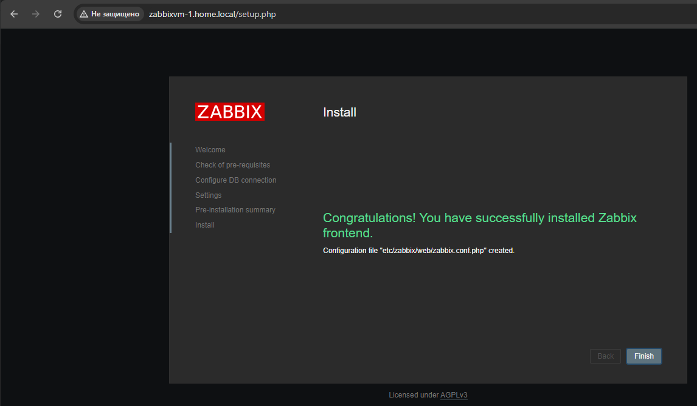

### Установка Zabbix агент на машину с CMS

```shell
rpm -Uvh https://repo.zabbix.com/zabbix/7.0/rocky/9/x86_64/zabbix-release-7.0-5.el9.noarch.rpm
dnf clean all
dnf install zabbix-agent2 zabbix-agent2-plugin-* zabbix-sender

cat << EOH > /etc/zabbix/zabbix_agent2.d/zabbix_server.conf
Hostname=$(hostname -f)
Server=zabbixvm-1.home.local
ServerActive=zabbixvm-1.home.local
EOH

systemctl enable --now zabbix-agent2
```

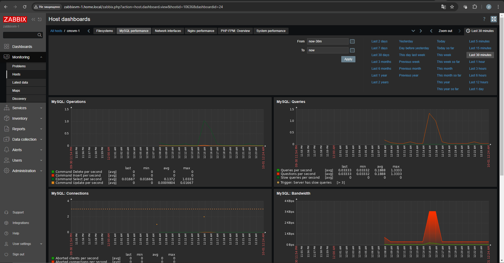

## Правила LLD

Написал [скрипт](config/test.sh) генерирующий метрики (за основу взял пример из лекции), выдал необходимые права

```shell
chmod +x /usr/local/test.sh
touch /usr/local/zdata.txt /usr/local/zabbix_sender.log
chown zabbix:zabbix /usr/local/zdata.txt /usr/local/zabbix_sender.log
```

Добавил `UserParameter` в конфигурацию агента для отправки метрик

```shell
cat << EOH > /etc/zabbix/zabbix_agent2.d/lld.conf
UserParameter=otus.discovery,/usr/local/test.sh
EOH
```

Создал правило обнаружения

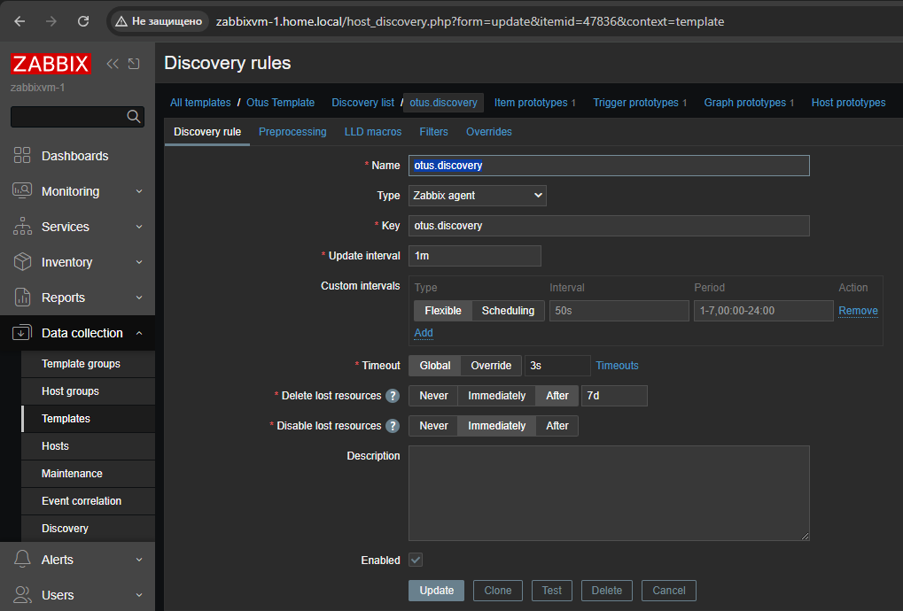

Создал прототип метрики

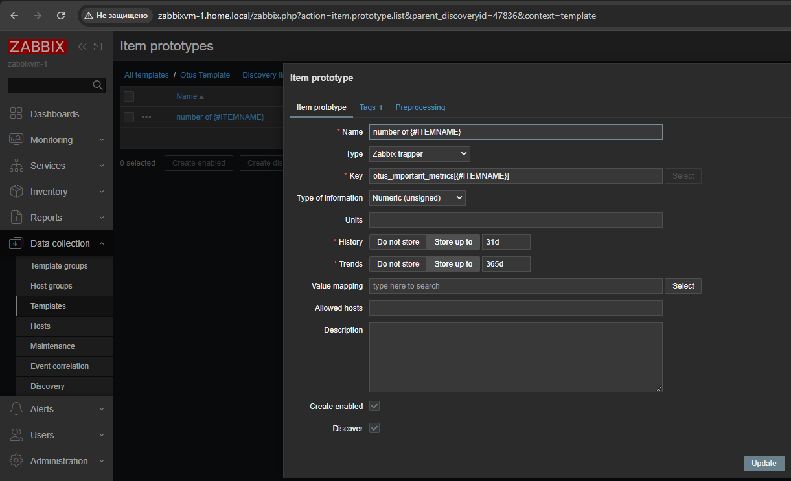

Создал прототип триггера, что бы он срабатывал когда значение метрики больше или равно 95

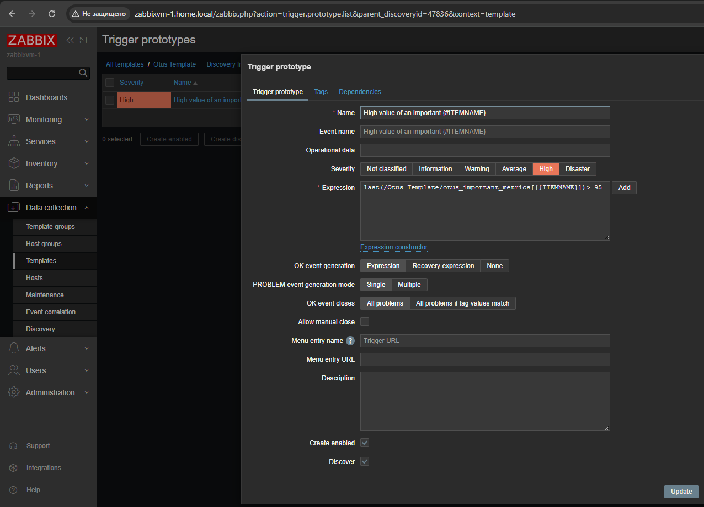

Создал прототип графика

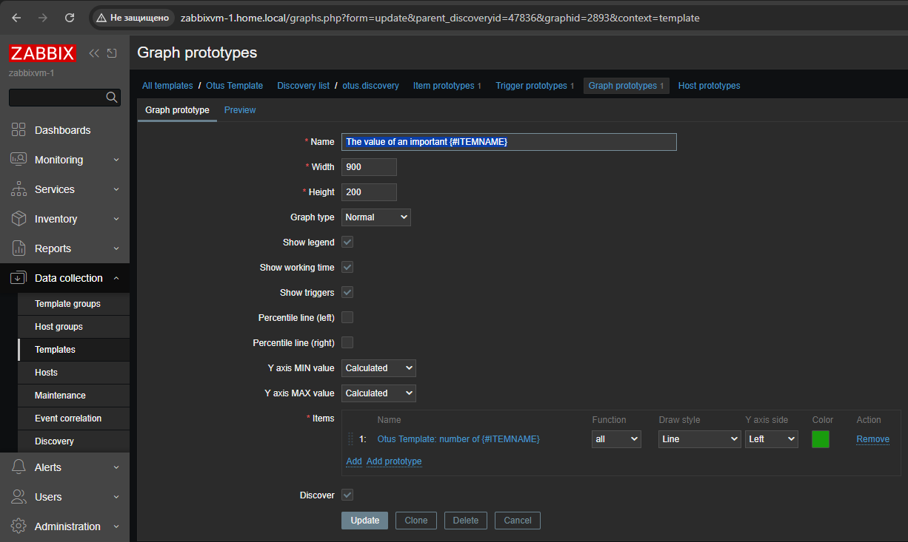

По данным с хоста видно, что метрики собираются и строятся графики

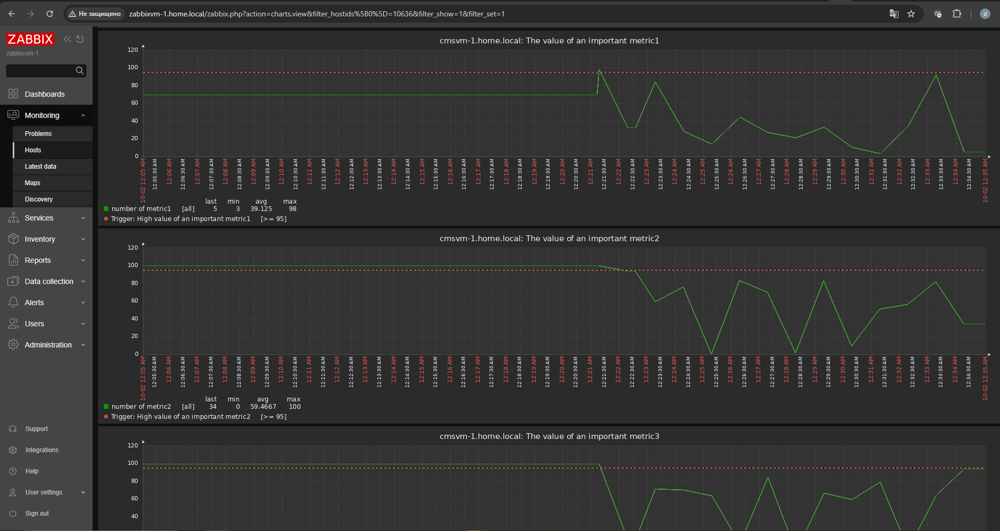

## Настройка алертинга

Включил и настроил *Media types* Telegram

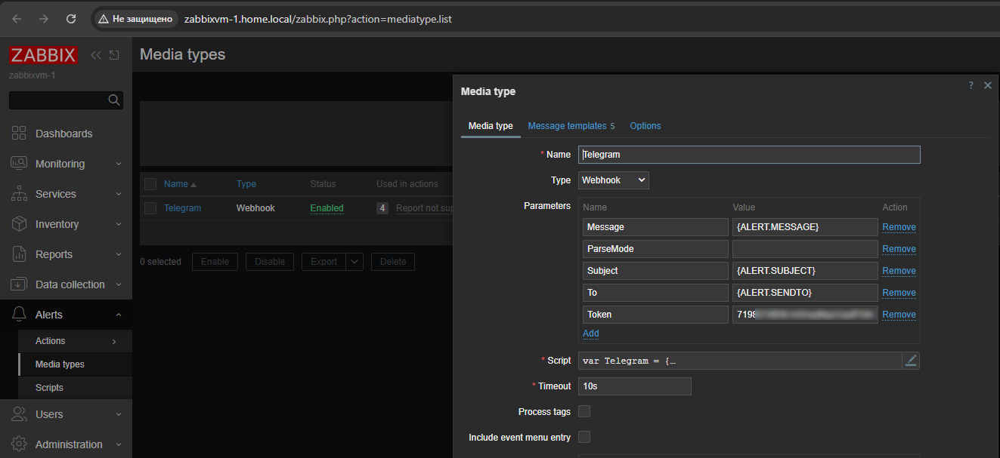

Включил канал оповещения для пользователя

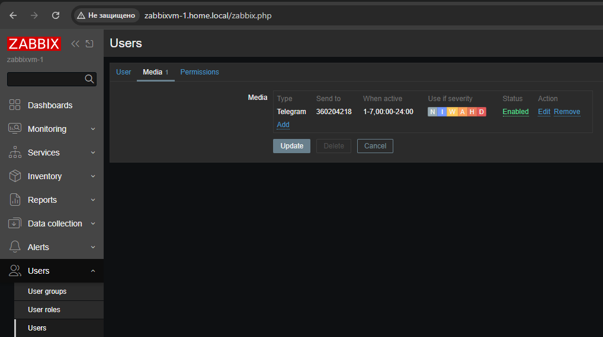

Настроил действие триггера

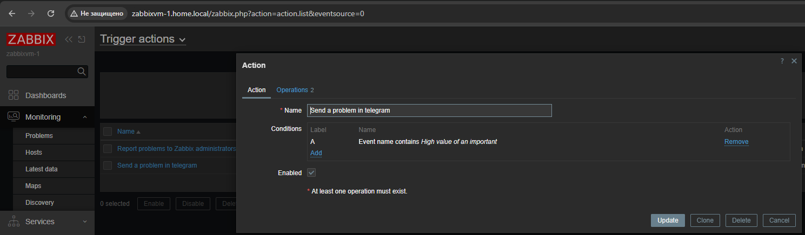

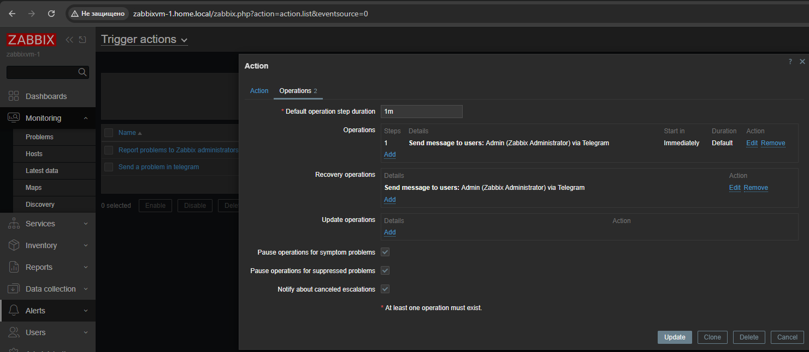

В списке проблем видно, что есть срабатывание триггера и происходит выполнение действия

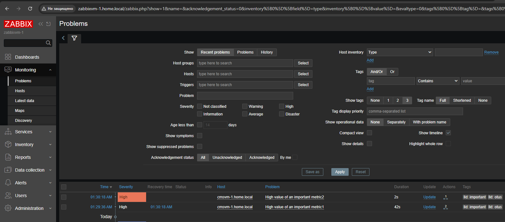

Уведомление приходит в телеграмм

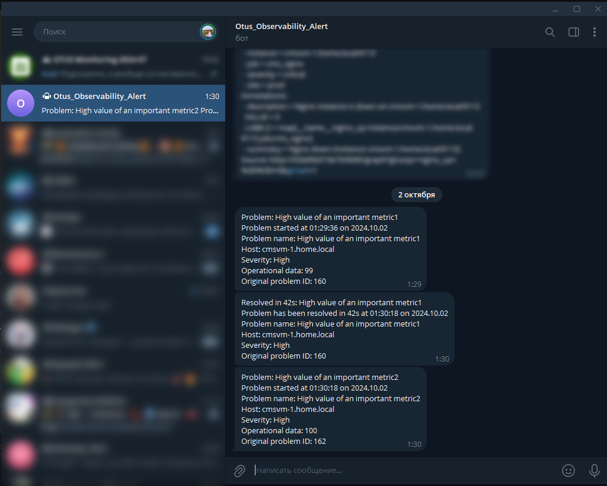
