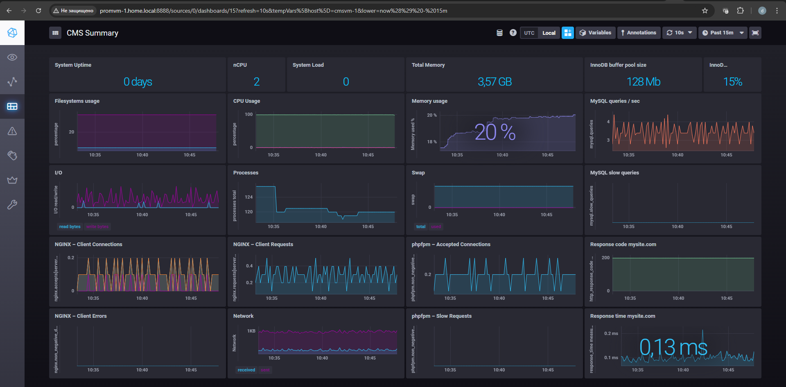
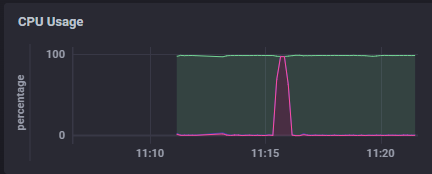
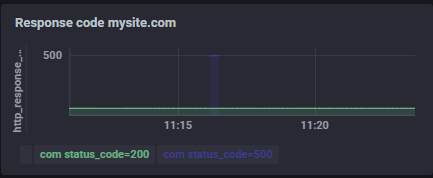
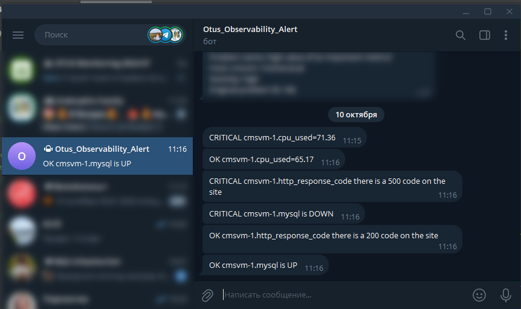

# Домашнее задание
Установка и настройка TICK стека

## Цель:
Установить и настроить Telegraf, Influxdb, Chronograf, Kapacitor.

Результатом выполнения данного ДЗ будет являться публичный репозиторий, 
в системе контроля версий (Github, Gitlab, etc.), в котором будет находиться Readme с описанием выполненных действий. 
Файлы конфигурации Telegraf, Influxdb, Chronograf, Kapacitor должны находиться в директории TICK-1.


## Описание/Пошаговая инструкция выполнения домашнего задания:
1. На виртуальной машине установите любую open source CMS, которая включает в себя следующие компоненты: nginx, 
php-fpm, database (MySQL or Postgresql);
2. На этой же виртуальной машине установите Telegraf для сбора метрик со всех компонентов системы 
(начиная с VM и заканчивая DB);
3. На этой же или дополнительной виртуальной машине установите Influxdb, Chronograf, Kapacitor
4. Настройте отправку метрик в InfluxDB.
5. Создайте сводный дашборд с самыми на ваш взгляд важными графиками, которые позволяют оценить работоспособность 
вашей CMS;
6. Настройте правила алертинга для чрезмерного потребления ресурсов, падения компонентов CMS и 500х ошибок;

# Решение

Для метрик была переиспользована машина из прошлого ДЗ [03-Prometheus-exporters](../03-Prometheus-exporters/README.md)
`#Машина с CMS`.

## Установка Telegraf

Создал пользователя для Telegraf в MySQL

```shell
mysql -uroot -p
mysql> CREATE USER 'telegraf'@'localhost' IDENTIFIED BY 'telegraf';
mysql> GRANT ALL PRIVILEGES ON *.* TO 'telegraf'@'localhost';
mysql> FLUSH PRIVILEGES;
mysql> quit;
```

На машину с CMS установил Telegraf

```shell
cat <<EOF | sudo tee /etc/yum.repos.d/influxdata.repo
[influxdata]
name = InfluxData Repository - Stable
baseurl = https://repos.influxdata.com/stable/\$basearch/main
enabled = 1
gpgcheck = 0
EOF
```

```shell
dnf install telegraf -y
```

Сформировал базовый конфиг Telegraf

```shell
telegraf config > telegraf.conf
```

Настроил для Telegraf сбор и отправку метрик в [01-telegraf.conf](TICK-1/telegraf/telegraf.conf) и разместил по пути `/etc/telegraf/telegraf.d/`

## Развёртывание Influxdb, Chronograf, Kapacitor

Influxdb, Chronograf, Kapacitor развернул на отдельной машине с помощью [docker-compose](TICK-1/docker-compose.yml)

Создал сводный дашборд [CMS Summary](TICK-1/chronograf/CMS_Summary.json) с основными метриками работы CMS



## Настройка алертинга

Настроил [правила алертинга](TICK-1/kapacitor/tasks) для чрезмерного потребления ресурсов, падения компонентов
CMS и 500х ошибок с отправкой их в Telegram

Во время имитации сбоя Kapacitor отправил соответствующие уведомления

- Повышенная утилизация CPU



- HTTP 500 при остановке MySQL



- Уведомления в Telegram

