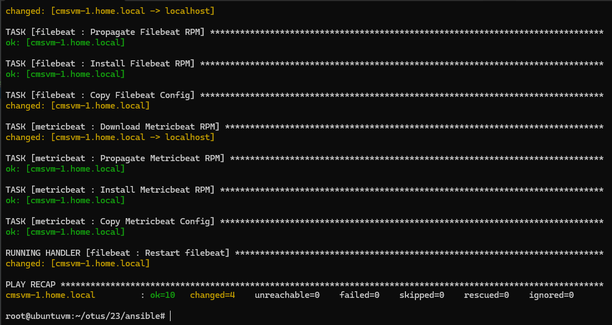
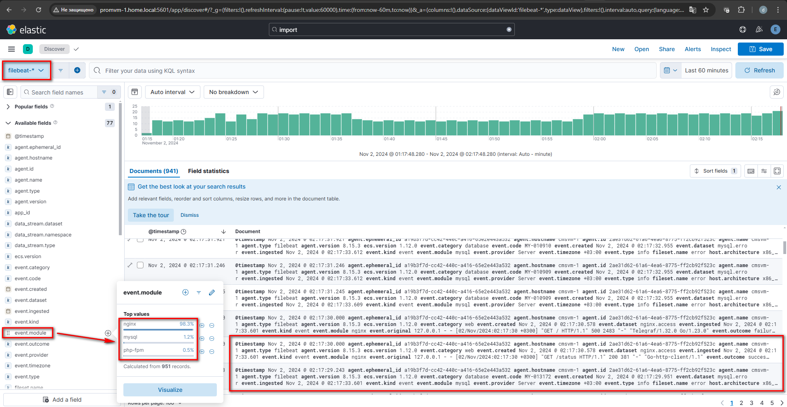
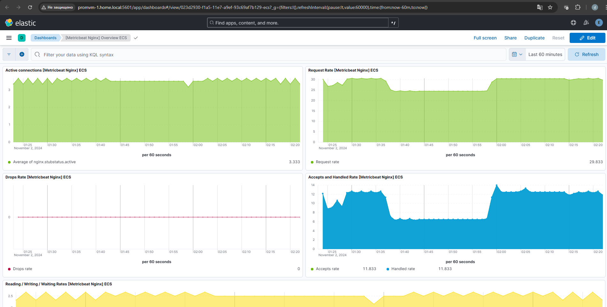
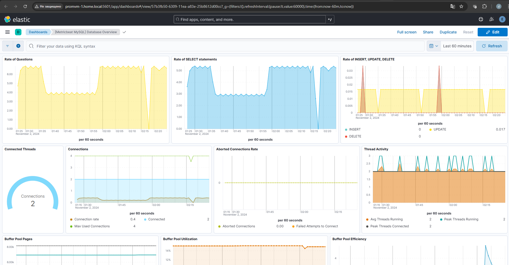
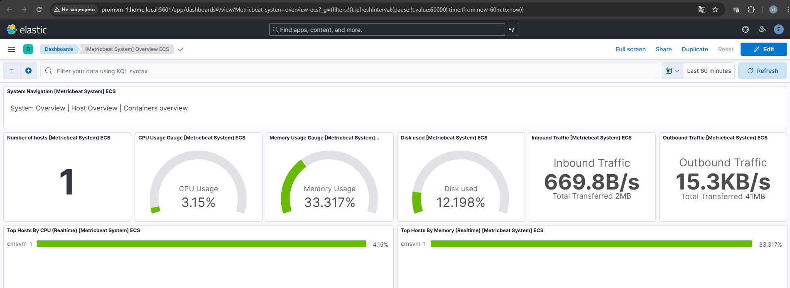
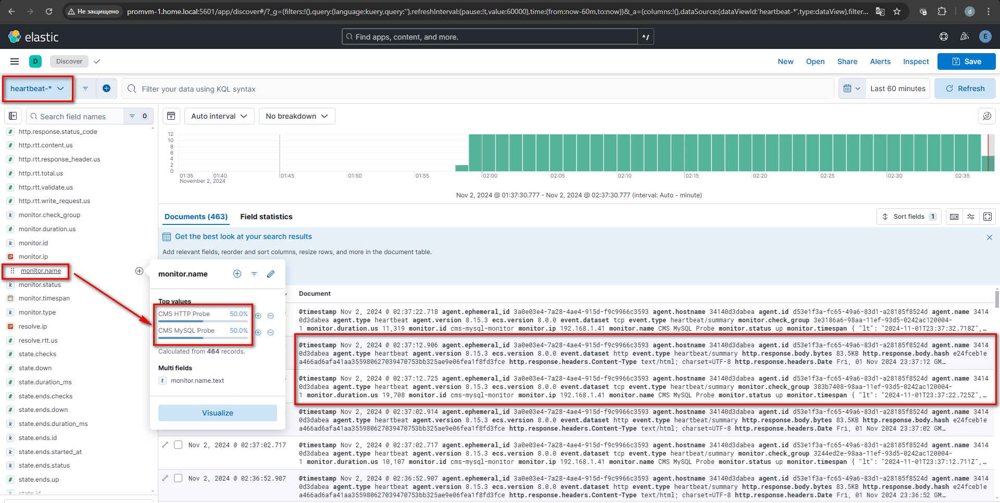

# Домашнее задание

Установка и настройка отправки данных с помощью Beats

## Цель

Научиться отправлять логи, метрики с помощью beats в elasticsearch.

## Описание/Пошаговая инструкция выполнения домашнего задания

Для успешного выполнения дз вам нужно сконфигурировать hearthbeat, filebeat и metricbeat на отправку данных в 
elasticsearch:

- На виртуальной машине установите любую open source CMS, которая включает в себя следующие компоненты: nginx, php-fpm, 
database (MySQL or Postgresql). Можно взять из предыдущих заданий;
- На этой же VM установите filebeat и metricbeat. Filebeat должен собирать логи nginx, php-fpm и базы данных. 
Metricbeat должен собирать метрики VM, nginx, базы данных;
- Установите на второй VM Elasticsearch и kibana, а также heartbeat;
Heartbeat должен проверять доступность следующих ресурсов: веб адрес вашей CMS и порта БД

## Задания со звездочкой

- Настройте политики ILM так, чтобы логи nginx и базы данных хранились 30 дней, а php-fpm 14 дней;
- Настройте в filebeat dissect для логов nginx, так чтобы он переводил access логи в json;

В качестве результата создайте репозиторий, приложите конфиги hearthbeat, filebeat и metricbeat.

Приложите скриншот полученных данных отображенных в Kibana.

---

# Решение

Для метрик была переиспользована машина из прошлого ДЗ [03-Prometheus-exporters](../03-Prometheus-exporters/README.md)
`#Машина с CMS`.

## Установка Filebeat и Metricbeat

Создал пользователя для Metricbeat в MySQL

```shell
mysql -uroot -p
mysql> CREATE USER 'metricbeat'@'localhost' IDENTIFIED BY 'metricbeat';
mysql> GRANT ALL PRIVILEGES ON *.* TO 'metricbeat'@'localhost';
mysql> FLUSH PRIVILEGES;
mysql> quit;
```

Для установки Filebeat и Metricbeat написал простые [роли](ansible/roles) Ansible

- Конфигурация Filebeat, там же сбор логов php-fpm - [filebeat.yml](ansible/roles/filebeat/files/etc/filebeat/filebeat.yml)
- Модуль Filebeat для nginx - [nginx.yml](ansible/roles/filebeat/files/etc/filebeat/modules.d/nginx.yml)
- Модуль Filebeat для mysql - [mysql.yml](ansible/roles/filebeat/files/etc/filebeat/modules.d/mysql.yml)


- Конфигурация Metricbeat - [metricbeat.yml](ansible/roles/metricbeat/files/etc/metricbeat/metricbeat.yml)
- Модуль Metricbeat для nginx - [nginx.yml](ansible/roles/metricbeat/files/etc/metricbeat/modules.d/nginx.yml)
- Модуль Metricbeat для mysql - [mysql.yml](ansible/roles/metricbeat/files/etc/metricbeat/modules.d/mysql.yml)
- Модуль Metricbeat для system - [system.yml](ansible/roles/metricbeat/files/etc/metricbeat/modules.d/system.yml)



## Установка Elasticsearch, kibana и Heartbeat

Данные сервисы развёрнуты с помощью [docker-compose.yml](docker/docker-compose.yml)

Сгенерировал пароли для пользователей в Elasticsearch

```shell
docker exec -i elastic /usr/share/elasticsearch/bin/elasticsearch-reset-password -u elastic
```

```shell
docker exec -i elastic /usr/share/elasticsearch/bin/elasticsearch-reset-password -u kibana
```

- Конфигурация Heartbeat - [heartbeat.yml](docker/heartbeat/heartbeat.yml)

## Логи, метрики

В Kibana доступны логи собираемые Filebeat



В Kibana доступны метрики собираемые Metricbeat, их можно посмотреть на дашбордах

- nginx



- mysql



- system



В Kibana доступны метрики собираемые Heartbeat

