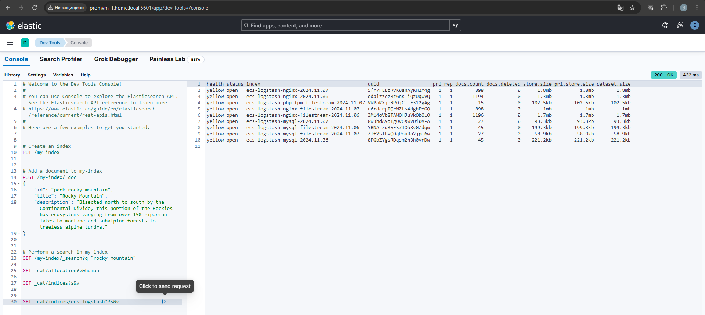
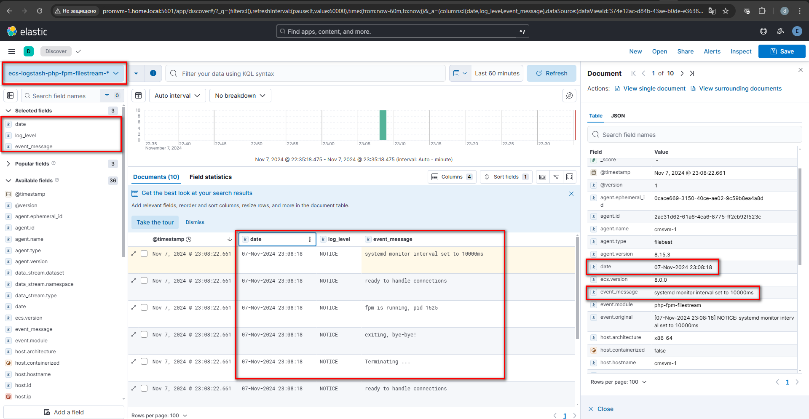
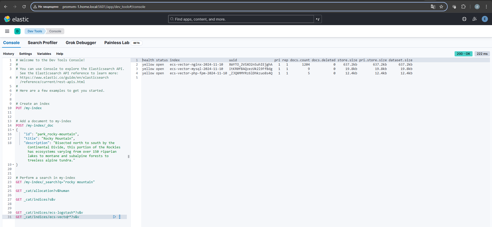
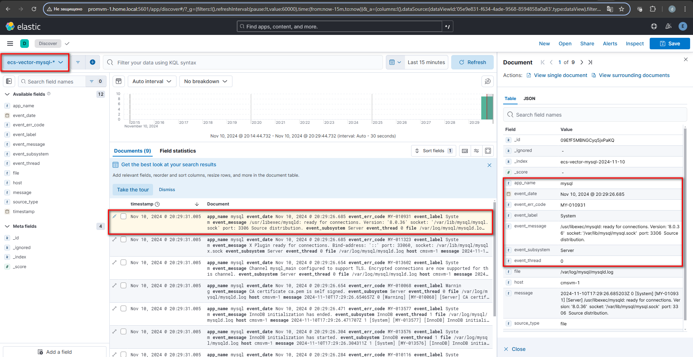

# Домашнее задание

Преобразование входящих сообщений с помощью Logstash и Vector

## Цель

Установить и настроить Logstash и Vector таким образом, чтобы происходил парсинг входящих сообщений.


## Описание/Пошаговая инструкция выполнения домашнего задания

Используйте тот же стенд из 2х VM как в предыдущем задании:

- Установите Logstash на виртуальную машину с Elasticsearch. Перенастройте отправку логов в него. 
В Logstash добавьте парсинг логов при помощи grok фильтр (Filebeat пусть при этом шлет сырые данные).
- Вместо Logstash установите и настройке Vector с аналогичным парсингом логов при помощи VRL.

## Задание со звездочкой

- Настройте Dead letter queue (DLQ) в Logstash.

- Настройте политики ILM в Logstash при отправке Elasticsearch.

В качестве результата создайте Git-репозиторий, приложите конфиги Logstash и Vector.

Приложите скриншот полученных в Kibana данных.

---

# Решение

## Logstash

Logstash запустил с помощью [docker-compose.yml](docker/docker-compose.yml)

- Конфигурация Logstash описана в [filebeat-pipeline.conf](docker/logstash/filebeat-pipeline.conf)

Filebeat установлен с помощью [Ansible](ansible/site.yml)

- Конфигурация Filebeat описана в [filebeat.yml](ansible/roles/filebeat/files/etc/filebeat/filebeat.yml)

Логи успешно записываются в отдельные индексы



Логи успешно парсятся с помощью описанных grok фильтров



## Vector

Vector установлен с помощью [Ansible](ansible/site.yml)

- Конфигурация Vector описана в [vector.yaml](ansible/roles/vector/files/etc/vector/vector.yaml)

Для доступа Vector к файлам логов добавил его пользователя в необходимые группы и поправил права на каталогах

```shell
usermod -a -G nginx vector
usermod -a -G mysql vector
chmod 644 /var/log/nginx/
```

С помощью [regex101.com](https://regex101.com/) и [playground.vrl.dev](https://playground.vrl.dev/) составил регулярные
выражения для парсинга логов

Логи успешно записываются в отдельные индексы



Логи успешно парсятся с помощью VRL

