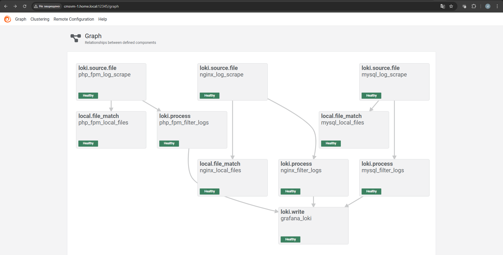
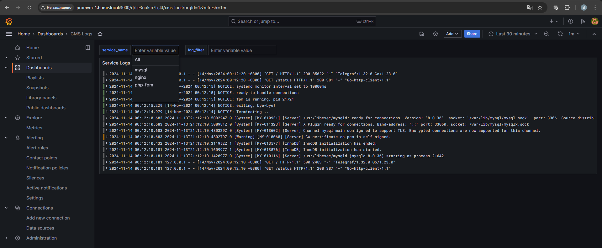

# Домашнее задание

Конфигурации Grafana Loki.

## Цель

Заменить Elasticsearch на Grafana Loki.

## Описание/Пошаговая инструкция выполнения домашнего задания

В данном ДЗ вы можете воспользоваться наработками из предыдущего.

В данном ДЗ вам предстоит заменить Elasticsearch на Grafana Loki. 
Убедитесь, что данные поступают в Grafana Loki и к ним есть доступ.

В качестве результата ДЗ принимаются - файл конфигурации Grafana Loki, 
файл конфигурации шиппера логов (любой шиппер на ваш выбор), скриншот, в котором видно, 
что вы получили доступ к логам в Grafana Loki.

---

# Решение

## Grafana Alloy

Для сбора логов установил Grafana Alloy с помощью [Ansible](ansible/site.yml)

- Конфигурация Alloy описана в [config.alloy](ansible/roles/alloy/files/etc/alloy/config.alloy)

Для доступа Alloy к файлам логов добавил его пользователя в необходимые группы и поправил права на каталогах

```shell
usermod -a -G nginx alloy
usermod -a -G mysql alloy
chmod 644 /var/log/nginx/
```

В UI Alloy виден статус и граф компонентов



## Grafana Loki

Grafana и Grafana Loki запустил с помощью [docker-compose.yml](docker/docker-compose.yml)

```shell
docker-compose up -d
```

- Конфигурация Grafana Loki описана в [loki-local-config.yaml](loki/loki-local-config.yaml)
- Источник данных для Grafana описан в [datasources.yml](grafana/provisioning/datasources/datasources.yml)
- Для доступа к логам создал дашборд [CMS_Logs.json](grafana/provisioning/dashboards/CMS_Logs.json)

Логи от компонентов CMS поступают в Loki и к ним есть доступ в Grafana

