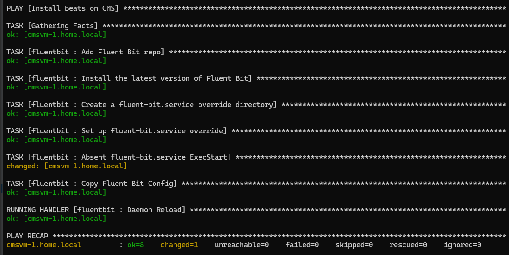
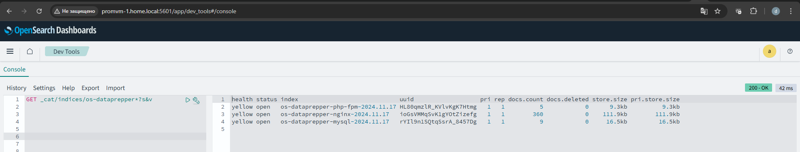
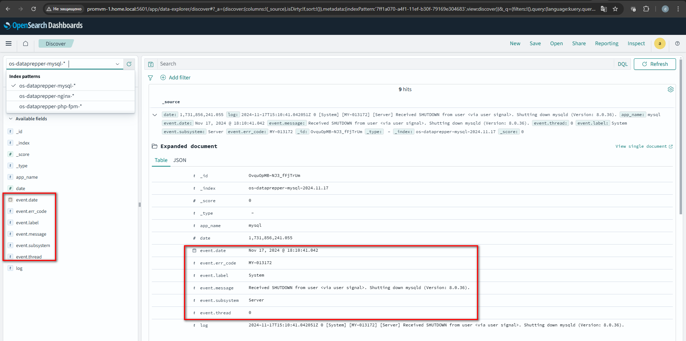

# Домашнее задание

Построение системы централизованного логирования на основе Opensearch

## Цель

Cообщения сохраняются в базу Opensearch и могут быть визуализированы через Opensearch Dashboard.

В ДЗ тренируются навыки:

- навыки работы с fluentbeat;
- навыки работы с datapreper;
- навыки работы с opensearch.

## Описание/Пошаговая инструкция выполнения домашнего задания:

Возьмите за основу стенд из занятий по Elasticstack:

- Замените filebeat на fluentbeat с аналогичной конфигурацией;
- Замените logstash на datapreper он должен принимать данные от fluentbeat;
- Замените Elasticsearch и Kibana на Opensearch и Opensearch Dashboard.

## Задание со звездочкой

- Настройте политики жизненного цикла как в занятии по elasticstack только через ISM.

В качестве результата предоставте примеры конфигурации fluentbit, datapreper и скриншоты с 
Opensearch Dashboard с выводом данных.

---

# Решение

## Fluent Bit

Для сбора логов установил Fluent Bit с помощью [Ansible](ansible/site.yml)

```shell
ansible-playbook site.yml -i inventory/beats.yml -u root -k
```



- Конфигурация Fluent Bit описана в [fluent-bit.yaml](ansible/roles/fluentbit/files/etc/fluent-bit/fluent-bit.yaml)

## Data Prepper

Data Prepper запущен с помощью [docker-compose.yml](docker/docker-compose.yml)

Конфигурация приёма, парсинга и отправки логов описана в [pipeline.yaml](docker/dataprepper/pipeline.yaml)

## Opensearch и Opensearch Dashboard

Opensearch и Opensearch Dashboard запущены с помощью [docker-compose.yml](docker/docker-compose.yml)

Данные от Data Prepper записываются в Opensearch. Для каждого приложения логи помещаются в отдельный индекс.



С помощью grok-парсера в Data Prepper журналы разбираются по полям и их можно просмотреть в Opensearch Dashboard

