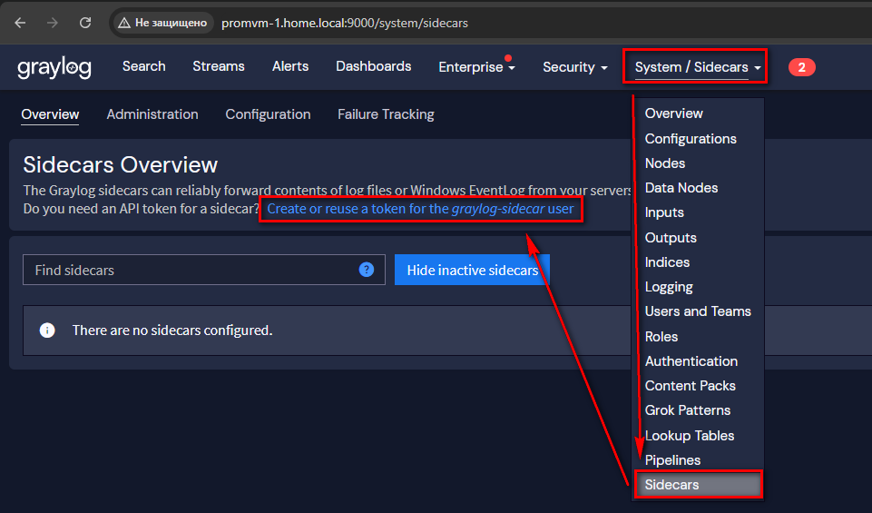
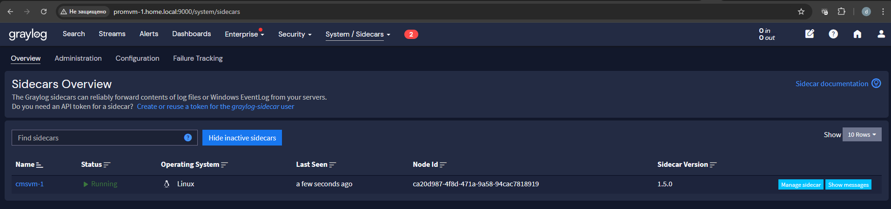
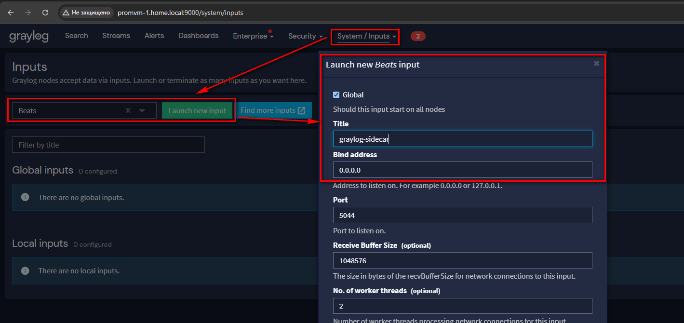
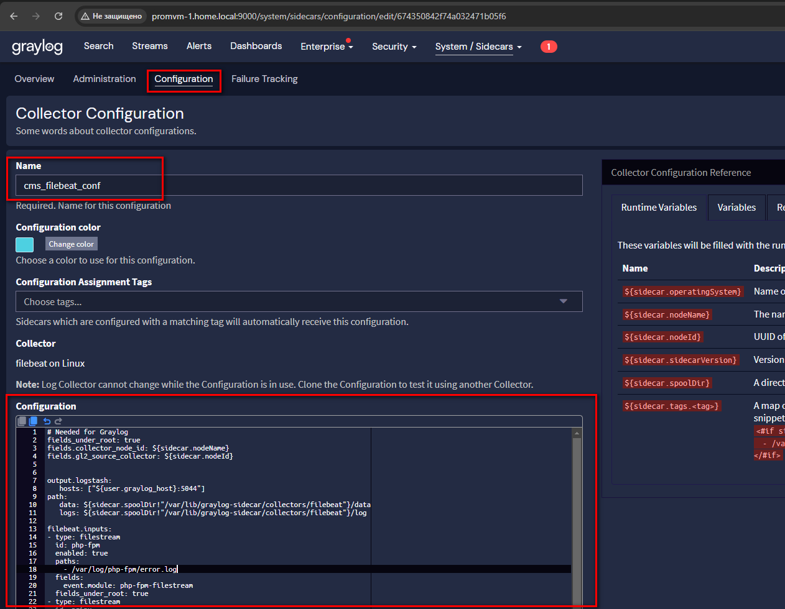
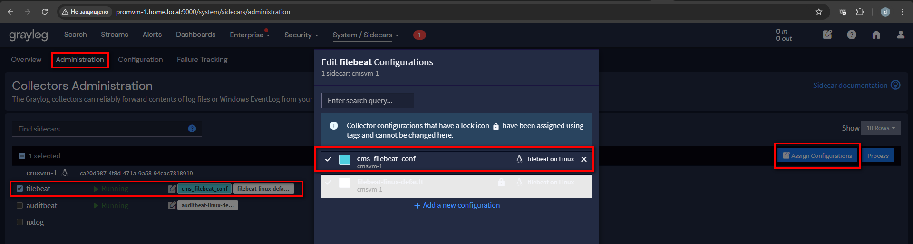
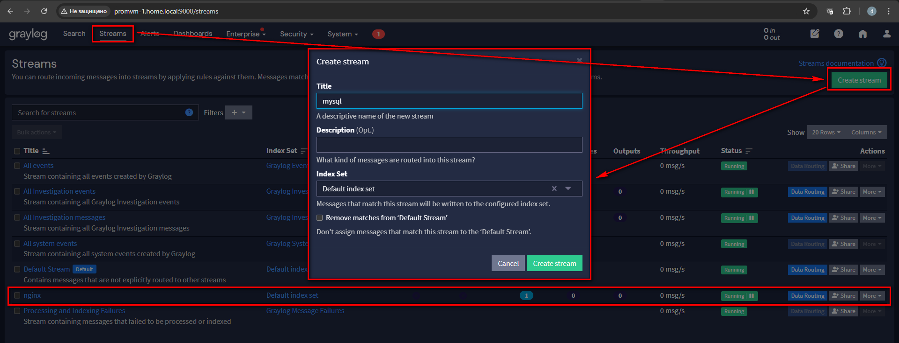
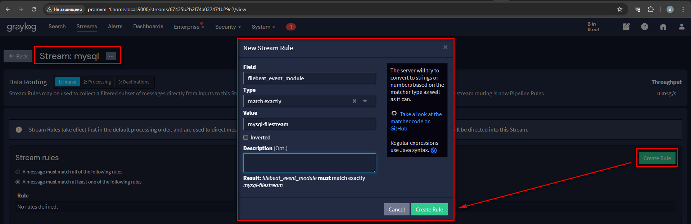
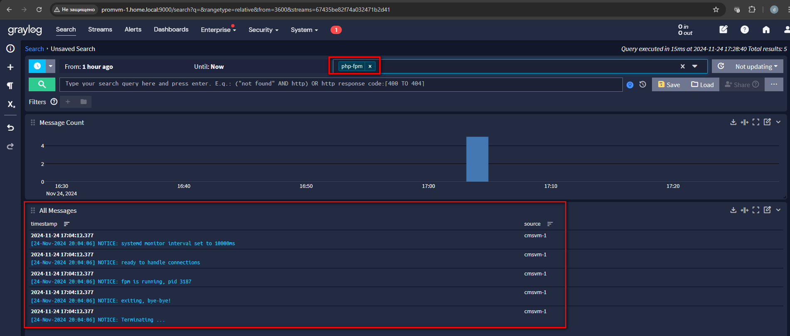
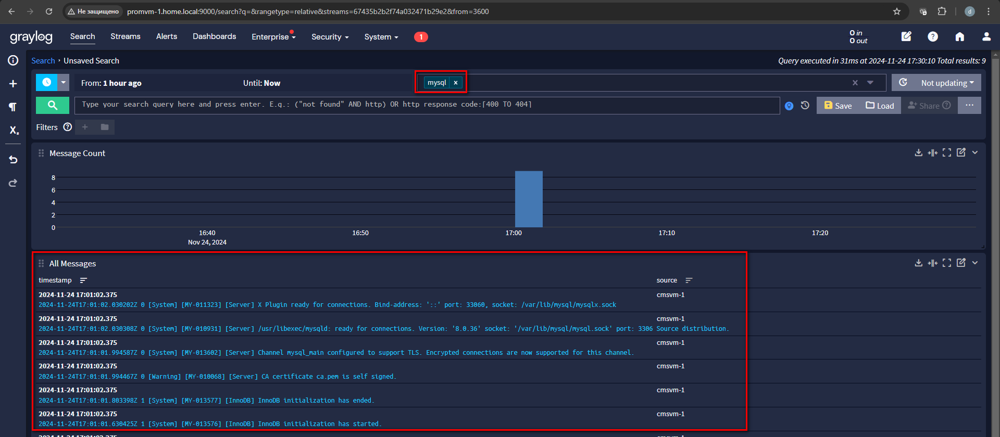
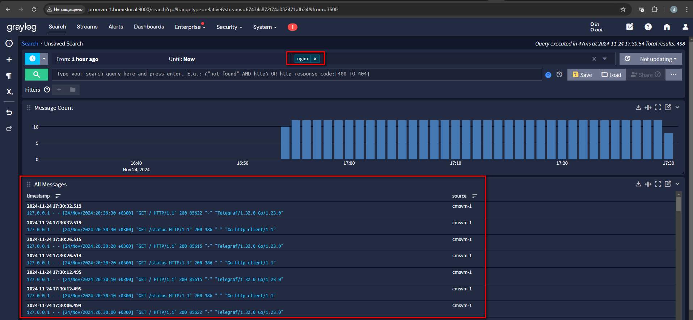

# Домашнее задание

Развертывание Graylog

## Цель

Научиться принимать логи в graylog и создавать на их основы стримы.

## Описание/Пошаговая инструкция выполнения домашнего задания

Для успешного выполнения ДЗ вам нужно сконфигурировать Graylog и отправку логов в него

- На виртуальной машине установите любую open source CMS, которая включает в себя следующие компоненты: nginx, 
php-fpm, database (MySQL or Postgresql). Можно взять из предыдущих заданий;
- На этой же VM установите graylog sidecar.
- Установите на второй VM Graylog (server, opensearch, mongodb) и datapreper
- Подключите установленный sidecar в graylog и настройте сбор и отправку логов nginx, 
php-fpm и базы данных, используя sidecar.
- Разделите логи в разные стримы.

В качестве результата создайте репозиторий, приложите конфиги datapreper, sidecar.

Приложите скриншот полученных данных отображенных в Graylog.

---

# Решение

Для метрик была переиспользована машина из прошлого ДЗ [03-Prometheus-exporters](../03-Prometheus-exporters/README.md)
`#Машина с CMS`.

## Установка Graylog Sidecar

На машину с CMS установил Graylog Sidecar

```shell
rpm -Uvh https://packages.graylog2.org/repo/packages/graylog-sidecar-repository-1-5.noarch.rpm
dnf -y install graylog-sidecar
```

## Запуск Graylog, Opensearch

Graylog, Opensearch запустил с помощью [docker-compose.yml](docker/docker-compose.yml)

```shell
docker-compose up -d
```

## Настройка Graylog Sidecar

Получил токен для Sidecar в Graylog Server



Добавил адрес сервера и полученный API токен в конфигурацию [sidecar.yml](graylog/sidecar/sidecar.yml)

```shell
vi /etc/graylog/sidecar/sidecar.yml
```

Зарегистрировал Sidecar как сервис и запустил

```shell
graylog-sidecar -service install
systemctl enable graylog-sidecar
systemctl start graylog-sidecar
```

Sidecar доступен в Graylog Server



Вместо datapreper решил использовать собственный input Graylog, т.к. datapreper не может отправлять данные если
Opensearch работает по http, а Graylog не может запустится, если ему не отдать CA самоподписного сертификата Opensearch. 
Пришлось перевести Opensearch на http и отказаться от datapreper.

Создал новый input



Создал конфигурацию filebeat для Sidecar



- Конфигурация filebeat [filebeat.conf](graylog/sidecar/filebeat.conf)

Подключил созданную конфигурацию к Sidecar



## Сбор логов

Создал отдельные стримы для логов



И правила маршрутизации логов в эти стримы



Логи попадают в соответствующие стримы

- php-fpm



- mysql



- nginx



